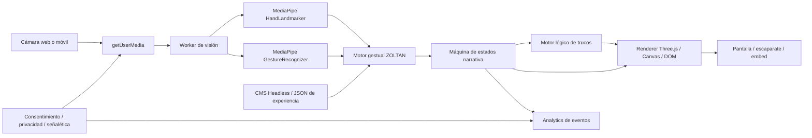
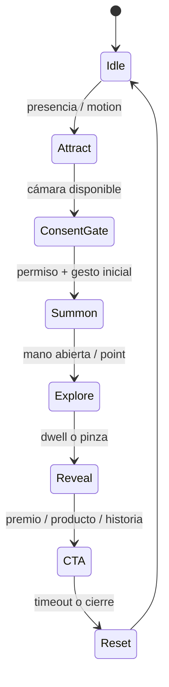

# ZOLTAN

## Resumen ejecutivo

ZOLTAN tiene un encaje claro y potente: **no debería plantearse como un “detector de gestos con juegos encima”, sino como un sistema de experiencias de asombro controlado** que mezcla tres capas complementarias. La primera capa es la **capa lógica**, heredada del corpus de ilusionismo matemático que has subido: Gilbreath, Kruskal, 1089, cuadrados mágicos, Fitch Cheney, Zeckendorf, Möbius, Dirac y otros principios que convierten el “azar” en una coreografía determinista. La segunda es la **capa escénica**, visible en la versión HTML subida y en el material visual del efecto wow: una puesta en escena elegante, modular, muy visual y orientada a producto/storytelling. La tercera es la **capa sensorial**, donde entra el reconocimiento gestual en web, móvil, escaparate o instalación. Esa combinación es la que puede hacer que ZOLTAN no parezca un kiosco tecnológico más, sino una pieza con firma propia. fileciteturn0file0 fileciteturn0file1

La oportunidad de mercado es real porque la pila técnica web actual ya permite reconocimiento de manos en tiempo real, landmarks 2D/3D, clasificación de gestos predefinidos y procesamiento desde cámara en navegador. MediaPipe para Web expone reconocimiento de gestos en tiempo real y landmarks de mano; su Hand Landmarker devuelve 21 puntos por mano y coordenadas también en espacio 3D, y su guía para web ya contempla uso sobre cámara o vídeo. TensorFlow.js ofrece una alternativa madura con `hand-pose-detection`, con soporte para runtime MediaPipe o TF.js y benchmarks públicos en varios dispositivos. citeturn30view0turn9view0turn9view1turn13view0turn14view2

La decisión estratégica correcta, por tanto, es construir **un núcleo ZOLTAN reusable** con estas piezas: captura de cámara, motor de interpretación gestual, máquina de estados narrativa, motor de “trucos” lógicos/matemáticos, capa visual reusable en Three.js/Canvas/DOM y un CMS para parametrizar contenidos, marcas, premios, textos y assets sin tocar código. Esa arquitectura permite servir desde un escaparate retail hasta una landing interactiva o una instalación de evento. Además, el material wow que has subido ya aporta una pista valiosa: la salida no tiene por qué ser siempre una interfaz plana; puede ser una **superficie viva** tipo cinta/rollo/altar digital que se abre o se despliega con gesto, muy adecuada para ZOLTAN. El componente técnico existente que analizamos localmente ya resuelve parte de esa capa de output con Three.js, vídeo como textura, caché de imágenes, control táctil/drag y loop infinito. citeturn30view0turn10view0turn9view4

Hay, eso sí, una limitación importante que conviene dejar documentada: **el enlace externo indicado no ha podido recuperarse desde este entorno**. La herramienta de navegación devolvió error de recuperación/caché, así que cualquier análisis específico de ese URL debe quedar marcado como **no verificado**. El report te da una base rigurosa usando los archivos accesibles y fuentes primarias sobre la tecnología, pero en ese punto concreto conviene tratarlo como “no especificado” hasta poder abrirlo en una sesión verificable. citeturn0view0turn4view1

## Lectura estratégica de los recursos

Los recursos subidos dibujan una ruta bastante coherente. El tratado textual no es una simple inspiración temática: es prácticamente un **catálogo de motores de asombro computables**, porque transforma principios de magia matemática en estructuras algorítmicas trasladables a UI, narrativa interactiva y reglas de juego. La HTML interactiva demuestra que ya existe una traducción inicial de ese corpus a interfaz navegable: pestañas temáticas, visualización de probabilidad, calculadora 1089, cuadrado mágico instantáneo y tabla de codificación factorial. El vídeo y la captura prueban otra cosa: que el proyecto ya está experimentando con una **gramática visual premium en 3D**, útil como envolvente escénica para experiencias ZOLTAN. fileciteturn0file0 fileciteturn0file1

| Recurso analizado | Qué aporta a ZOLTAN | Mecánicas o assets observables | Limitaciones detectadas | Implicación de diseño |
|---|---|---|---|---|
| `Pegado text(281).txt` | Base conceptual de magia matemática y lógica | Gilbreath, Kruskal, 21 cartas, Miraskill, CATO, Fitch Cheney, cuadrados mágicos, 1089, Fibonacci/Zeckendorf, Möbius, Dirac | No es aún producto ni UX; falta sistematizarlo como “biblioteca de efectos” | Convertir cada principio en módulo reusable de game design |
| `la_arquitectura_del_asombro.html` | Prueba de interfaz editorial/interactiva | Navegación por dominios, Chart.js, widgets lógicos, tono expositivo | Sin cámara, sin gestos, sin CMS, sin analítica ni persistencia | Excelente base para demos, microsites y educación de marca |
| Captura + vídeo del efecto wow | Lenguaje escénico premium | Rollo/cinta 3D, desenrollado lateral, layout editorial, interacción suave | Es presentación visual, no motor gestual por sí mismo | Reutilizarlo como “surface layer” de ZOLTAN |
| `infinite-3d-wow-ticker.zip` | Componente técnico reutilizable | Three.js, vídeo/imagen como textura, loop, drag/touch, caché, control de GPU | No incorpora visión por computador ni lógica de juego | Integrarlo como renderer de catálogo, revelación o ritual de producto |
| URL `magic-card-mentalism` | Potencial referencia directa de Gesture Lab | **No verificado** | No recuperable desde este entorno | Marcar “no especificado” hasta auditoría en directo |

En términos de mecánica, el material subido apunta a una tesis muy fértil: **ZOLTAN debe apoyarse más en gestos simples y robustos que en gestos “espectaculares” pero frágiles**, y trasladar la verdadera magia al motor narrativo-lógico. Esa decisión está alineada con la tecnología disponible. MediaPipe Gesture Recognizer ya ofrece un vocabulario base útil —`Open_Palm`, `Closed_Fist`, `Pointing_Up`, `Thumb_Up`, `Thumb_Down`, `Victory`, `ILoveYou`— y, además, expone 21 landmarks por mano y coordenadas world-space para derivar movimientos como swipe, pinza, hold, trazado, rotación o distancia entre dedos. En otras palabras: no hace falta inventar 40 poses exóticas; basta con unas pocas poses robustas y una capa geométrica/temporal bien diseñada. citeturn30view2turn30view0turn9view0

A nivel técnico, la HTML subida todavía es **monolítica y orientada a demostración**, porque depende de scripts de CDN, de interacciones directas en el hilo principal y de widgets desacoplados entre sí. Para dar el salto a producto, ZOLTAN necesita desacoplar claramente detección, interpretación, escena y contenido. La propia guía oficial de MediaPipe advierte que las llamadas `detect()` y `detectForVideo()` bloquean el hilo principal y recomienda mover este trabajo a Web Workers; MDN documenta que los workers ejecutan scripts en segundo plano sin interferir con la UI y que `OffscreenCanvas` permite incluso renderizar fuera del DOM y en worker. Esa recomendación es especialmente relevante si quieres kioscos fluidos, móviles y escenas Three.js simultáneas. citeturn9view1turn25view0turn27view0

La capa visual wow encaja especialmente bien como **disparador de descubrimiento**. En el análisis directo del vídeo y la captura se observa un rollo 3D que se abre desde la izquierda, alberga layouts editoriales y de producto, y favorece navegación horizontal e inmersiva. En el ZIP local, el componente Three.js usa una geometría de plano segmentado, mapea curvatura para el desenrollado, soporta loop, autoplay, rueda, drag, touch y teclado, y convierte imágenes o vídeo en texturas canvas optimizadas para el límite de textura GPU. Eso lo convierte en candidato natural para tres salidas ZOLTAN: escaparate narrativo, catálogo ritualizado y revelación de premio o profecía.

## Catálogo de experiencias para ZOLTAN y Gesture Lab

La siguiente lista está diseñada para ser **comercializable y construible** con una pila web realista. La validación técnica parte de lo que hoy exponen MediaPipe y TensorFlow.js en web: reconocimiento de gestos en tiempo real, 21 landmarks por mano, landmarks 3D, ejecución sobre cámara/vídeo y posibilidad de customización de modelos o de reglas derivadas de landmarks. La customización existe, pero la propia guía oficial de MediaPipe advierte que Model Maker sigue disponible aunque ya no se mantiene activamente; por eso, para MVP y v1 conviene priorizar un “gesture grammar engine” basado en landmarks + reglas temporales, y reservar modelos custom para v2 o casos de alto valor. citeturn30view0turn30view3turn13view0turn5academia2turn24academia0

| Top | Nombre | Descripción | Mecánica gestual requerida | Inputs / outputs | Complejidad técnica | Tiempo interacción | Sectores objetivo | Personalización de marca | Riesgos legales / éticos | Novedad |
|---|---|---|---|---|---|---|---|---|---|---|
| ★ | Oráculo de Carta ZOLTAN | El usuario “invoca” una carta o símbolo y la experiencia la revela como predicha | Mano abierta para iniciar, pointing dwell para elegir, pinch para confirmar | Cámara RGB / pantalla web, móvil, kiosk | Media | 45–90 s | Retail, eventos, lujo, cultura | Dorso, palo, narrativa, premio, copy | Cámara en público, evitar claims engañosos con premio | Alta |
|  | La Carta que Te Piensa | La carta parece escoger al usuario según microdecisiones | Pointing + hold + swipe | Cámara + audio + pantalla | Media | 40–70 s | Activaciones, hospitality | Voz, tono, deck visual | Sesgo de lenguaje si se personaliza demasiado | Alta |
|  | Camino de Kruskal | Elecciones aparentemente libres convergen en un destino de marca | Pointing secuencial, tap aéreo | Cámara/touch / animación nodal | Media | 60–90 s | Educación, editorial, campañas | Mensaje final, nodos, rutas | Necesita onboarding claro | Alta |
| ★ | Profecía Gilbreath | El usuario “mezcla” colores/ítems y siempre emerge un patrón imposible | Swipe izquierda/derecha, droplet gesture | Cámara/touch / cartas, fichas o packshots | Baja-media | 30–60 s | FMCG, moda, beauty | Paleta, SKU, claim, reveal | Si hay premio, explicar bases | Alta |
| ★ | Cuadrado Mágico de Marca | El usuario da un número y se construye una matriz que suma siempre esa cifra | Pointing sobre números, pinch confirmar | Cámara/touch / matriz animada | Baja-media | 45–75 s | Banca, educación, ferias, branding | Colores, cifras clave, aniversario, precio | Bajo; dato numérico no personal | Media-alta |
| ★ | Portal 1089 | Ritual numérico corto que desemboca siempre en un destino sorpresa | Gesto de escribir en aire o selección por pointing | Cámara/touch / pantalla, impresión, QR | Baja | 30–50 s | Retail, editorial, campañas | Página, premio, copy final | Bajo; muy apto para web | Media-alta |
|  | Predicción Fibonacci | Dos números iniciales generan una profecía de suma o resultado final | Pointing, arrastre de semillas | Cámara/touch / partículas y panel | Baja-media | 45–70 s | Educación, fintech, museos | Números, visualización, CTA | Bajo | Media |
|  | Mapa Zeckendorf | Un número “pensado” se reconstruye por selección de tarjetas o símbolos | Pointing sobre cartas flotantes | Cámara/touch / tarjetas, tokens | Media | 60–90 s | Educación, juegos, eventos | Tokens, nivel, skin | Curva de explicación | Alta |
|  | Fitch Cheney Dúo | Dos personas codifican y descifran un secreto en escena | Dos manos, pointing y orden secuencial | Cámara multiusuario / gran display | Alta | 90–150 s | Eventos, team building, museos | Cartas, claves, mensaje oculto | Multiusuario y privacidad | Alta |
|  | Miraskill Balance | El usuario divide pares y el sistema predice el diferencial final | Pointing, arrastre por bloques | Cámara/touch / tablero binario | Media | 45–70 s | Educación, activaciones | Colores, iconografía | Bajo | Media |
|  | CATO Reversal | Tras inversiones “caóticas”, solo un elemento queda diferente | Flip gesture, closed fist / open palm | Cámara/touch / grid binario | Media | 45–80 s | Museos, education, brand labs | Iconos, tarjetas, avatars | Onboarding necesario | Alta |
|  | Degrees of Freedom Wall | Plegados virtuales y colapsos de patrón en un muro | Two-hand spread, fold gesture | Cámara RGB + display grande | Alta | 60–120 s | Exposiciones, corporate lobbies | Visual system, data art | Complejidad cinética | Alta |
|  | Möbius Story Loop | La historia nunca acaba donde el usuario cree | Circle gesture, swipe longitudinal | Cámara / banda 3D o cinta narrativa | Media | 45–90 s | Editorial, moda, turismo | Capítulos, claims, voiceover | Bajo | Alta |
|  | Dirac 720 Challenge | El usuario debe completar una secuencia de giro “imposible” | Rotación de muñeca, trazo circular | Cámara / escena 3D, score | Alta | 30–75 s | Eventos, ciencia, educación | Skin visual, recompensa | Fatiga; accesibilidad | Alta |
|  | Dados Suma Siete | Se revela la suma invisible de dados u objetos opuestos | Pointing, hold, reveal | Cámara/touch / dados 3D o packs | Baja-media | 20–45 s | FMCG, gaming, educación | Producto como dado, premio | Bajo | Media |
|  | Ruleta del Destino | La ruleta parece libre pero lleva a un final narrativo | Swipe, open palm stop | Cámara/touch / rueda, luces, audio | Baja-media | 25–60 s | Eventos, turismo, retail | premios, mensajes, copy | Si hay premio, compliance promocional | Media |
| ★ | Summon the Product | Un gesto “despierta” el producto o escaparate | Open palm para activar, pointing para navegar | Cámara RGB / pantalla, escaparate, móvil | Media | 20–60 s | Retail, automotive, real estate, beauty | Producto, motion, CTA, idiomas | Cámara en vía pública, señalización | Alta |
| ★ | Catálogo Aéreo Infinito | Navegación por un carrusel/teletipo 3D usando swipe en el aire | Swipe horizontal, pinch pause, point select | Cámara + Three.js ticker / display o web | Media | 30–90 s | Moda, lujo, turismo, decoración | Assets, ritmo, look editorial | Atención en público; fallback táctil | Alta |
|  | Escaparate Susurrante | El escaparate cambia según el gesto del viandante | Approaching + pointing + hold | Cámara frontal / pantalla gran formato | Media-alta | 10–40 s | Retail high street | Vitrina, colecciones, mensajes | Captación en zona pública | Alta |
|  | Rasca el Aire | Revelación de capas ocultas sin tocar la pantalla | Movimiento de mano sobre áreas, wipe gesture | Cámara / máscara con shader | Media | 20–50 s | Beauty, alimentación, gaming | Capas visuales, premios | Bajo | Media-alta |
|  | Moodboard Alquímico | El usuario mezcla estilos para generar un look o concepto | Pinch & drag, spread | Cámara/touch / canvas o 3D board | Media | 45–90 s | Moda, branding, interiorismo | Materiales, colores, tipografías | Bajo | Media |
|  | Selector del Color Hero | El gesto elige el color “destinado” del producto | Pointing con dwell sobre paleta flotante | Cámara/touch / producto recoloreado | Baja | 20–45 s | Retail, ecommerce, beauty | SKU, paleta, CTA | Bajo | Media |
|  | Constelación de Marca | Unir puntos en el aire crea logo o símbolo oculto | Trazado con índice, hold final | Cámara / partículas, logo reveal | Media | 30–75 s | Corporate, eventos, lujo | Logo, claim, música | Recoger trayectorias requiere aviso si se almacenan | Alta |
|  | Firma en el Aire | El usuario deja una rúbrica/sigil que activa un resultado | Air writing + confirm | Cámara / export visual, QR | Media-alta | 40–90 s | Eventos, deporte, fandom | Plantillas, filtros, merchandising | No usar como firma legal | Alta |
|  | Aura de Producto | Mano y objeto generan una “aura” personalizada | Open palm cerca del producto, sweep | Cámara / VFX, recomendación | Media | 20–50 s | Beauty, wellness, tech | Estilo visual, copy, CTA | Evitar claims biomédicos | Media-alta |
| ★ | Cupón Conjurado | Completar un gesto/misión desbloquea un beneficio real | Secuencia de 2–3 gestos simples | Cámara/touch / QR, wallet pass | Baja-media | 20–45 s | Retail, QSR, eventos | Reward, branding, CRM | Términos promo y fraude | Alta |
| ★ | Portales de Capítulo | La historia avanza por puertas gestuales con decisiones guiadas | Pointing, push, hold | Cámara/touch / vídeo, 3D, audio | Media | 60–150 s | Turismo, museos, branded content | Ramas narrativas, locución | Bajo | Alta |
|  | Caza del Tesoro | El usuario busca señales invisibles en un layout o vitrina | Pointing y barrido | Cámara + mapa / recompensa | Media | 60–120 s | Centros comerciales, turismo | Premios, pistas, localización | Menores, tiempos de permanencia | Media |
|  | Alquimia de Ingredientes | Mezclar ingredientes o atributos produce una receta/claim | Arrastre en aire, pinch combine | Cámara/touch / objetos 2D/3D | Media | 30–60 s | Alimentación, perfumería | Ingredientes, packaging, upsell | Claims regulatorios del producto | Media |
|  | Precio Escondido | Solo con la secuencia correcta aparece una oferta | Swipe, hold, thumbs up | Cámara/touch / reveal, QR | Baja | 20–40 s | Retail performance | Precio, urgencia, CTA | Compliance promocional | Media |
|  | Filtro Social Hechizado | Mini experiencia vertical pensada para web/social/mobile | Gestos simples frente a cámara frontal | Móvil / vídeo breve, share | Baja-media | 10–30 s | Social campaigns | Marcos, copy, UGC | Menores y sharing | Media |
|  | Emoji Spell Battle | El usuario conjura iconos o reacciones como combate ligero | Victory, thumbs, pointing | Cámara móvil / score, stickers | Baja-media | 20–45 s | Social, entretenimiento | Emojis, marca, pack de premios | Bajo | Media |
|  | Memory Air Flip | Parejas de cartas o productos reveladas con pointing | Pointing dwell, swipe next | Cámara/touch / grid y score | Baja-media | 45–90 s | Retail, educación, familias | Productos, logos, mensajes | Accesibilidad cognitiva | Media |
| ★ | Director de Orquesta | La mano dirige tempo, luz y capas narrativas en escena | Conducting gestures, raise/lower hand | Cámara / audio-reactive visuals | Alta | 45–120 s | Eventos, arte, corporate, música | Sonido, tempo, narrativa, branding | Grabación en público si documentas sesión | Muy alta |
|  | Sigilo en el Aire | El dibujo del usuario genera un símbolo final único | Air path + ML de trazos | Cámara / SVG o 3D glyph | Alta | 40–90 s | Gaming, fandom, moda | Sigilos, prints, NFT no recomendable por defecto | Si se guarda trazo, informar | Alta |
|  | Atrapa la Partícula | Juego de reflejos con partículas o iconos de marca | Pointing chase, pinch catch | Cámara / score HUD | Media | 20–45 s | Eventos, retail, sports | Skin, niveles, leaderboard | Competición y datos de ranking | Media |
|  | Dúo Telepático | Dos usuarios deben sincronizar gestos para desbloquear el final | Two-hand sync, mirrored gestures | Cámara amplia / gran display | Alta | 60–120 s | Team building, ferias | Narrativa de marca, premios | Multiusuario y fairness | Alta |
| ★ | Reliquia Despierta | Una pieza de museo/objeto cobra vida con gesto ritual | Open palm, reveal sweep, point hotspots | Cámara / 3D, audio espacial | Media-alta | 45–120 s | Museos, patrimonio, lujo | Storytelling, locución, capas históricas | Señalética y accesibilidad | Alta |
|  | Teorema Vivo | Un principio matemático se convierte en juego performativo | Pointing, step-by-step gestures | Cámara/touch / explicación y wow final | Media | 60–120 s | Educación, museos, editoriales | Tema, tono, evaluación | Bajo | Media-alta |
|  | Sombras Narrativas | Las manos crean escenas o pistas tipo teatro de sombras | Siluetas simples, open/close hand | Cámara / siluetas, audio | Media | 30–75 s | Infantil, cultura, family | Personajes, moraleja, branding suave | Menores y consentimiento | Media |
|  | Concierge Oracle | Un hotel o destino revela experiencias según gesto/ánimo | Thumbs, pointing, hold | Cámara/touch / recomendaciones | Media | 30–60 s | Hospitality, turismo | oferta, upsell, idioma | Perfilado si combina preferencias | Media |
|  | Medidor de Empatía | La interacción desbloquea una historia solidaria o donación | Gesture sequence + hold | Cámara / storytelling + donate CTA | Media | 30–75 s | ONG, CSR, campañas | causa, visuales, CTA | Sensibilidad emocional, menores | Media-alta |

## Top de viabilidad y prototipos técnicos

Si priorizo por **valor comercial inmediato + factibilidad web real + posibilidad de demo rápida**, el top más sólido queda así:

| Prioridad | Experiencia | Viabilidad comercial | Viabilidad técnica | Tiempo estimado a demo funcional | Riesgo |
|---|---|---:|---:|---|---|
| 1 | Summon the Product | 5/5 | 5/5 | 2–3 semanas | Bajo |
| 2 | Catálogo Aéreo Infinito | 5/5 | 4/5 | 3–4 semanas | Bajo-medio |
| 3 | Oráculo de Carta ZOLTAN | 5/5 | 4/5 | 3–4 semanas | Medio |
| 4 | Cuadrado Mágico de Marca | 4/5 | 5/5 | 1–2 semanas | Bajo |
| 5 | Portal 1089 | 4/5 | 5/5 | 1–2 semanas | Bajo |
| 6 | Cupón Conjurado | 5/5 | 4/5 | 2–3 semanas | Medio |
| 7 | Portales de Capítulo | 4/5 | 4/5 | 3–5 semanas | Medio |
| 8 | Profecía Gilbreath | 4/5 | 4/5 | 2–3 semanas | Bajo |
| 9 | Director de Orquesta | 4/5 | 3/5 | 4–6 semanas | Medio-alto |
| 10 | Reliquia Despierta | 4/5 | 3/5 | 4–6 semanas | Medio |

La arquitectura recomendada para esos módulos debe separar captura, detección, interpretación, narrativa y render. MediaPipe para web permite crear las tareas con `@mediapipe/tasks-vision`, configurar `runningMode`, número de manos y umbrales, y trabajar sobre flujos de vídeo/cámara. La guía oficial muestra, además, que Gesture Recognizer y Hand Landmarker funcionan sobre `VIDEO`, y que ambos exponen suficiente información para construir tanto clasificación directa como gramáticas derivadas por landmarks. Para experiencias más especiales, TensorFlow.js `hand-pose-detection` puede actuar como fallback o como vía de benchmarking cruzado. citeturn30view1turn30view2turn9view0turn13view0turn14view2



**Prototipo uno: Oráculo de Carta ZOLTAN**

La mejor versión MVP no es un “truco de cartas genérico”, sino una experiencia donde el usuario activa ZOLTAN, selecciona una ruta o carta con pointing, hace un gesto de confirmación y recibe una **profecía cerrada**, idealmente con lead magnet o CTA final. Técnicamente basta con limitar el vocabulario a `Open_Palm`, `Pointing_Up`, `Closed_Fist` y una pinza derivada por distancia entre pulgar e índice. Eso reduce falsos positivos y simplifica onboarding. MediaPipe Gesture Recognizer ya reconoce las poses base, mientras que Hand Landmarker da 21 landmarks y world coordinates para derivar la pinza y el dwell. citeturn30view2turn30view0turn9view0

**Librerías y stack recomendado:** `@mediapipe/tasks-vision`, `three`, `zustand` o estado simple, `motion` o GSAP para transiciones, audio Web Audio API, y DOM/Canvas para overlays. Si se quiere versión alternativa o comparativa, `@tensorflow-models/hand-pose-detection` permite `runtime: 'mediapipe'` o `runtime: 'tfjs'`. citeturn30view2turn13view0turn14view2

**Pseudocódigo**

```ts
initCamera();
initGestureTasks(); // MediaPipe: HandLandmarker + GestureRecognizer
loadExperienceConfig("zoltan-oracle.json");
state = "idle";

loop(videoFrame) {
  hand = handLandmarker.detectForVideo(videoFrame);
  gesture = gestureRecognizer.recognizeForVideo(videoFrame);

  derived.pinch = distance(thumbTip, indexTip) < PINCH_THRESHOLD;
  derived.pointingTarget = hitTest(hand.indexFingerTip, cardHotspots);
  derived.dwell = updateDwell(derived.pointingTarget);

  switch (state) {
    case "idle":
      if (gesture === "Open_Palm") state = "summon";
      break;

    case "summon":
      playIntroVFX();
      state = "selection";
      break;

    case "selection":
      highlight(derived.pointingTarget);
      if (derived.dwell > 700 || derived.pinch) {
        selected = derived.pointingTarget;
        state = "reveal";
      }
      break;

    case "reveal":
      forcedOutcome = rulesEngine.resolve(selected, config.forceMode);
      renderReveal(forcedOutcome);
      logEvent("oracle_reveal", forcedOutcome);
      state = "cta";
      break;

    case "cta":
      showCTA(config.cta);
      if (timeout) reset();
      break;
  }
}
```

**Integración CMS / embeds:** un JSON por experiencia con `theme`, `deck`, `forceMode`, `copy`, `cta`, `reward`, `locales`, `analyticsTags`. Formatos de despliegue: custom element `<zoltan-experience slug="oracle-ss26">`, embed JS o iframe. Si va en iframe con cámara, hay que permitir `camera` mediante `allow` y servir siempre por HTTPS. citeturn9view3turn9view4

**Prototipo dos: Cuadrado Mágico de Marca**

Este es probablemente el mejor MVP “wow-to-build ratio”. Ya tienes su lógica documentada en los recursos subidos y una traducción HTML prototipada. Conviene evolucionarlo a una versión gestual donde el usuario levanta la mano para iniciar, apunta a un número o introduce una cifra por panel flotante, y ve cómo la matriz se completa animadamente con branding, colores y posibilidad de captura/QR final. El valor aquí no es solo sorprendente: es **corporativo, educativo y fácilmente explicable**. fileciteturn0file0 fileciteturn0file1

**Librerías y stack recomendado:** DOM/Canvas 2D o Pixi para MVP, `@mediapipe/tasks-vision` para gesto, y export opcional de imagen con `html-to-image` o canvas propio. No hace falta Three.js salvo que quieras una rejilla muy escénica. citeturn30view2turn9view0

**Pseudocódigo**

```ts
const GRID_TEMPLATE = [
  ["A", 1, 12, 7],
  [11, 8, "B", 2],
  [5, 10, 3, "C"],
  [4, "D", 6, 9]
];

function buildMagicSquare(n: number) {
  return {
    A: n - 20,
    B: n - 21,
    C: n - 18,
    D: n - 19
  };
}

onGestureFrame(frame) {
  target = detectNumberHotspot(frame.hand.indexFingerTip);
  if (dwell(target) > 600) selectedNumber = target;
  if (pinchConfirm()) {
    const vars = buildMagicSquare(selectedNumber);
    renderGrid(GRID_TEMPLATE, vars);
    animateSums(selectedNumber);
    emitAnalytics("magic_square_done", { selectedNumber });
  }
}
```

**Integración CMS / embeds:** ideal para campañas donde cada cliente define `seedNumbers`, `copy`, `brandColor`, `finalReward`, `shareMessage`. Puede convivir con fallback táctil casi sin fricción, muy útil en móvil y accesibilidad.

**Prototipo tres: Summon the Product con Catálogo Aéreo Infinito**

Este es el puente más directo entre el material wow y ZOLTAN. La escena arranca en estado pasivo; cuando detecta `Open_Palm`, se abre un rollo 3D con productos, stories o looks; `swipe` navega; `pointing dwell` enfoca un producto; `pinch` pausa y despliega detalle, vídeo o CTA. Aquí sí reaprovecharía el componente local ya analizado, porque resuelve curvatura, navegación y reproducción de vídeo como textura. La parte nueva es conectar los landmarks/gestos al desplazamiento y a la selección. Technical fit muy alto. citeturn30view2turn9view0turn10view0

**Librerías y stack recomendado:** `three`, componente wow local, `@mediapipe/tasks-vision`, posiblemente GSAP para easing editorial, y CMS de assets. Para rendimiento, detección en worker, y valorar `OffscreenCanvas` si el target son kioscos con escenas pesadas. MediaPipe señala que `detectForVideo()` bloquea el hilo principal; MDN documenta workers y `OffscreenCanvas` como estrategia para sacar carga de la UI. citeturn9view1turn25view0turn27view0

**Pseudocódigo**

```ts
initWowTicker(config.assets);
gestureState = { swipeVelocity: 0, selectedIndex: null };

loop(videoFrame) {
  hand = handLandmarker.detectForVideo(videoFrame);
  gesture = gestureRecognizer.recognizeForVideo(videoFrame);

  if (state === "idle" && gesture === "Open_Palm") {
    ticker.open();
    state = "browse";
  }

  if (state === "browse") {
    gestureState.swipeVelocity = estimateHorizontalVelocity(hand.indexFingerTipPath);
    ticker.applyExternalVelocity(gestureState.swipeVelocity);

    hovered = ticker.hitTest(projectToViewport(hand.indexFingerTip));
    ticker.highlight(hovered);

    if (dwell(hovered) > 800 || pinchConfirm(hand)) {
      ticker.focus(hovered);
      showProductPanel(hovered);
      emitAnalytics("product_focus", hovered.id);
      state = "detail";
    }
  }

  if (state === "detail" && gesture === "Closed_Fist") {
    closeProductPanel();
    state = "browse";
  }
}
```

**Integración CMS / embeds:** cada experiencia debería consumirse desde una estructura como:

```json
{
  "experienceSlug": "zoltan-window-fw26",
  "mode": "window-retail",
  "theme": {
    "palette": ["#111", "#f5f2ec"],
    "logo": "brand.svg"
  },
  "assets": [
    {"type": "image", "src": "look-01.jpg"},
    {"type": "video", "src": "drop-hero.mp4"}
  ],
  "gestures": {
    "activate": "Open_Palm",
    "select": "Pointing_Dwell",
    "confirm": "Pinch"
  },
  "cta": {
    "label": "Descubrir",
    "href": "/coleccion"
  }
}
```

Ese esquema permite servir el mismo motor en web, móvil, iframe embebido, escaparate y microsite, cambiando solo contenido y reglas.

## Datos, privacidad, UX y métricas

En ZOLTAN hay que separar dos cosas que a menudo se mezclan mal. **Una cosa es captar imagen de personas; otra, identificar biométricamente a una persona.** El RGPD define los datos biométricos como datos personales obtenidos por tratamiento técnico específico sobre rasgos físicos, fisiológicos o conductuales que permitan o confirmen la identificación única de una persona. El mismo texto aclara que el tratamiento de fotografías no debe considerarse automáticamente una categoría especial, pero sí entra ahí cuando se usan medios técnicos específicos para identificar o autenticar de forma unívoca. Y el artículo 9 prohíbe por regla general el tratamiento de categorías especiales, incluidos datos biométricos dirigidos a identificar de forma unívoca a una persona física. Para ZOLTAN, esto significa que **puedes diseñar experiencias de gesto sin identidad**, procesando manos y poses en tiempo real y descartando vídeo; pero en cuanto intentes reconocer a la persona, perfilarla fuertemente o conservar imágenes, el marco de riesgo cambia mucho. citeturn17view0turn17view2

Además, el propio RGPD exige especial prudencia cuando se controlan zonas de acceso público a gran escala con dispositivos optoelectrónicos y remite a la evaluación de impacto relativa a la protección de datos cuando el tratamiento pueda entrañar alto riesgo. También insiste en protección de datos desde el diseño y por defecto. En términos prácticos: para escaparates, ferias y activaciones en espacios públicos, ZOLTAN debería nacer con **privacy by design**, sin grabar por defecto, sin identificar personas, sin mezclar vídeo con CRM salvo consentimiento claro, y con señalización visible. citeturn28view0turn28view2turn28view3

| Área de datos | Recomendación para MVP | Retención por defecto | Riesgo | Control recomendado |
|---|---|---|---|---|
| Vídeo de cámara | Procesamiento efímero en navegador | 0 s | Medio | No almacenar ni transmitir |
| Landmarks de mano | Solo en memoria de sesión | 0 s | Bajo-medio | Borrado al cerrar/reset |
| Gestos reconocidos | Sí, como eventos anónimos | 30–90 días si hay analytics | Bajo | Sin IP completa ni vídeo asociado |
| Resultado / score | Sí, para métricas | 30–90 días | Bajo | Seudonimizar sesión |
| Lead / email / cupón | Solo tras CTA y consentimiento | Según política de cliente | Medio | Consentimiento separado |
| Grabación para replay | No en MVP | Desactivado | Alto | Solo opt-in explícito |
| Identificación biométrica | No recomendada | No aplicar | Muy alto | Excluir del alcance inicial |

Desde el punto de vista web, también hay restricciones técnicas que afectan al producto. `getUserMedia()` requiere contexto seguro —HTTPS o `localhost`—, solicita permiso del usuario, y en `iframe` debe declararse `allow="camera"` para poder usar cámara en ese frame. Si alguna instalación necesita supervisión remota, streaming o control entre navegadores, entonces entra WebRTC como capa opcional de transporte P2P de medios y datos; no es necesario para el MVP local, pero sí muy útil en v2 para consola de operación remota o experiencias sincronizadas. citeturn9view4turn9view3turn26view0

La validación UX debe asumir una realidad demostrada por la literatura: en interacción touchless pública todavía hay falta de estándares, los usuarios necesitan claves de descubrimiento y aceptación, y en entornos públicos se prefieren interacciones más aceptables, prácticas y situadas que gestos arbitrarios o teatrales sin contexto. Esa evidencia respalda tres reglas de diseño para ZOLTAN: **activar con gesto evidente**, **confirmar con dwell/pinza y feedback visible**, y **ofrecer fallback táctil o QR** cuando el contexto no favorezca el gesto. citeturn29view0turn29view1



| Hipótesis UX | Métrica principal | Objetivo recomendado |
|---|---|---|
| La gente entiende cómo empezar sin ayuda humana | Time to first successful interaction | < 8 s |
| El sistema responde con sensación “mágica” y no “torpe” | Latencia gesto-a-feedback | < 120 ms kiosk, < 180 ms móvil |
| La detección es robusta | Precision de gesto útil | > 95% estático controlado, > 90% en vivo |
| La experiencia no dispara acciones fantasma | False positive idle rate | < 1 cada 2 min |
| El onboarding no pesa | Completion rate | > 65% en público, > 80% en web guiada |
| Hay deseo de repetir | Replay rate | > 20% |
| Convierte negocio | CTR/CTA o cupón reclamado | según vertical; retail objetivo 8–15% de finalización a CTA y 3–8% redención |
| La privacidad se entiende | Comprensión de señalética/consent | > 80% en intercept survey |
| El motor es visualmente fluido | FPS sostenidos | > 30 kiosk, > 24 móvil |

## Roadmap, costes y arquitectura de ejecución

La hoja de ruta razonable no es construir 40 juegos a la vez; es crear **una plataforma mínima con 3 experiencias bandera** y una biblioteca reusable de gestos, reglas y componentes visuales. Para el MVP, la mejor tríada es: **Cuadrado Mágico de Marca**, **Oráculo de Carta ZOLTAN** y **Summon the Product / Catálogo Aéreo Infinito**. Esa combinación cubre branded content, retail y “wow factor”, y permite reutilizar casi toda la arquitectura. MediaPipe para web ya ofrece paquete NPM, modos `IMAGE/VIDEO`, landmarks y recognizer en tiempo real; el punto delicado no es la viabilidad de base, sino cómo empaquetas rendimiento, narrativa y privacidad. citeturn30view2turn30view0turn9view1

| Fase | Alcance | Tiempo estimado | Equipo mínimo | Entregables |
|---|---|---|---|---|
| MVP | Núcleo ZOLTAN + 3 experiencias + CMS JSON simple + analytics básicos + señalética privacidad | 4–6 semanas | 1 creative technologist full-stack, 1 diseñador motion/UX, 0.5 QA/PM | Demo web, kiosk mode, pack de configuración, documentación de embed |
| v1 | 5–8 experiencias productizadas + panel editorial + multiidioma + cupones/QR + fallback touch + presets por sector | 6–8 semanas adicionales | 1 full-stack, 1 frontend/Three, 1 diseñador, 0.5 PM/QA | Librería de experiencias, panel de contenidos, dashboard de métricas |
| v2 | Custom gestures, multiusuario, WebRTC ops remoto, training pipeline, A/B tests, CRM/CDP connectors, export de sesiones | 8–12 semanas adicionales | 2 devs, 1 ML engineer parcial, 1 diseñador, 1 PM/QA | Plataforma madura, consola de operación, integración enterprise |

| Experiencia comparada | Features clave | Coste estimado relativo | Tiempo estimado | Riesgo principal |
|---|---|---:|---|---|
| Cuadrado Mágico de Marca | números, reveal, share, CTA | € | 1–2 semanas | que parezca demasiado educativo si el arte no acompaña |
| Portal 1089 | ritual corto, viral, móvil-friendly | € | 1–2 semanas | repetición si no varía la narrativa |
| Profecía Gilbreath | mezcla aparente y patrón final | €€ | 2–3 semanas | explicar bien la interacción |
| Oráculo de Carta ZOLTAN | selección, reveal, premio, lore | €€ | 3–4 semanas | precisión de pointing/dwell |
| Summon the Product | activación, product reveal, CTA | €€ | 2–3 semanas | lectura de gesto en escaparate con luz cambiante |
| Catálogo Aéreo Infinito | navegación 3D, vídeo, foco de producto | €€€ | 3–4 semanas | rendimiento si compites con la visión en mismo hilo |
| Cupón Conjurado | gamificación + reward | €€ | 2–3 semanas | compliance legal de promo |
| Portales de Capítulo | narrativa ramificada | €€€ | 3–5 semanas | coste de contenido |
| Director de Orquesta | música, escena, multi-capa | €€€€ | 4–6 semanas | tuning fino y hardware |
| Reliquia Despierta | hotspots, 3D, patrimonio | €€€ | 4–6 semanas | producción de assets y accesibilidad |

Mi recomendación de construcción es esta: **usar MediaPipe en web como base principal**, porque su guía oficial para Gesture Recognizer y Hand Landmarker está lista para JavaScript y cubre directamente cámara/vídeo; **usar TensorFlow.js como benchmark o fallback técnico**, no como dependencia primaria del MVP; **procesar detección en worker** por la naturaleza síncrona de `detectForVideo()`; **usar Three.js solo donde aporte escena real**; y **dejar custom training de gestos para v2**, porque Model Maker sigue disponible pero está marcado como no activamente mantenido. También tiene sentido preparar desde el día uno un pequeño dataset interno de gestos ZOLTAN, apoyado en HaGRID o HaGRIDv2 como referencia estructural para futuras iteraciones. citeturn30view2turn9view1turn25view0turn27view0turn30view3turn24academia0turn24academia1

Para Codex y para el equipo técnico, las referencias maestras a seguir deberían ser: las guías oficiales de MediaPipe para Gesture Recognizer y Hand Landmarker en web; la guía de customización y sus advertencias; el repositorio y blog oficial de TensorFlow.js Hand Pose Detection; la documentación de MDN sobre `getUserMedia`, Web Workers, `OffscreenCanvas` y WebRTC; la documentación de Three.js; y, en capa de investigación, los trabajos sobre interacción touchless en displays públicos y aceptación de interacción situada. Todo eso ya da una base suficiente para construir ZOLTAN con rigor y sin humo futurista innecesario. citeturn30view0turn9view0turn23view0turn13view0turn14view2turn9view4turn25view0turn27view0turn26view0turn10view0turn29view0turn29view1

En síntesis, ZOLTAN no debería venderse como “gestural gimmick”; debería posicionarse como **motor de asombro inmersivo**. Tus recursos ya apuntan en esa dirección: lógica fuerte, estética fuerte y un hueco claro para una capa sensorial robusta. Si construyes el núcleo reusable primero y las experiencias bandera después, tienes una base sólida para escaparates, webs, móviles e instalaciones sin rehacer producto cada vez. Y si el enlace externo se puede auditar en una siguiente iteración, lo adecuado será incorporarlo como cuarta fuente específica; por ahora, el diseño debe asumir ese punto como **no especificado**. fileciteturn0file0 fileciteturn0file1 citeturn0view0turn4view1